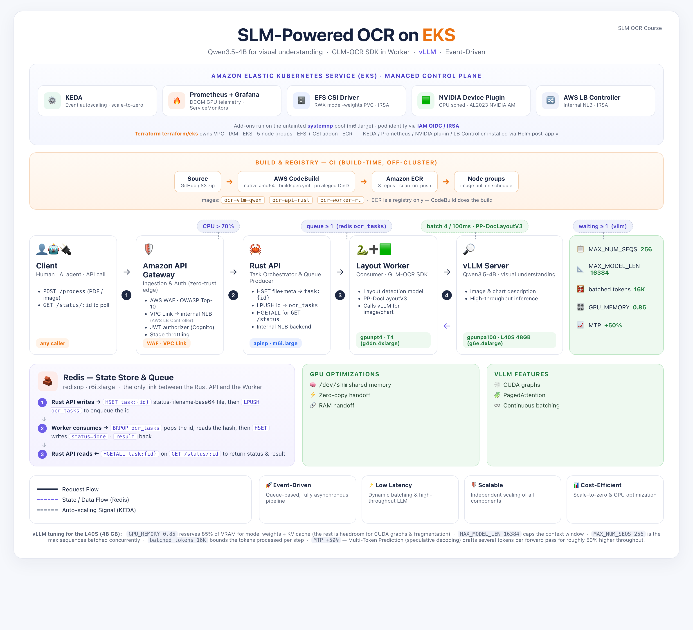
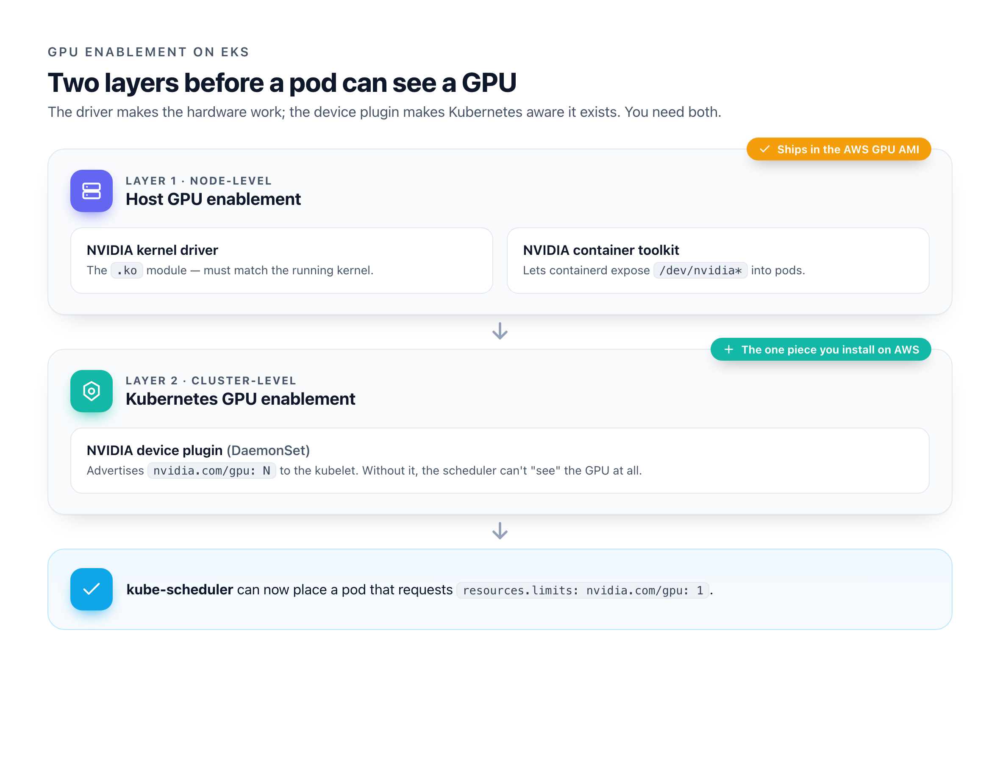
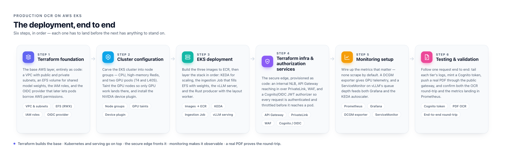
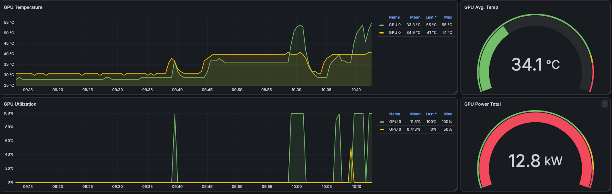

Welcome reader,

The great production OCR course (https://theneuralmaze.substack.com/t/production-ocr-course) builds its system on Azure. I moved it to AWS expecting a rewrite. What I got instead was a lesson in exactly which part of a production AI stack cares what cloud it runs on 

TLDR: It's a smaller part than you'd think.

This post is the map of that move: what changed, what didn't, and the handful of AWS-specific traps that cost me the most time.

The code lives here: https://github.com/neural-maze/production-ocr-course

# The design constraints for production readiness

From my experience, designing AI systems for the enterprise means being deliberate about a few things:
- **Scalability**: you can't assume the load stays constant, so you need an architecture that scales both up and down. Kubernetes orchestration coupled with KEDA gets you there — you own your infrastructure entirely and stay in control of your cost.
- **Private network**: you want to reduce the surface you expose. As the course explains, you design your systems behind a curtain and leave open only the smallest door your applications need to be used.
- **GPU optimization and cost efficiency**: GPUs are the expensive part, so cost optimization is not optional.
- **Resiliency and SLM usage**: one of the big debates in recent AI system design is around SLMs. These models bring real independence and cost savings, but you don't want the maintenance headache — that's where vLLM comes in.
- **Asynchronous pipeline**: queue-based, asynchronous tasks give you stronger resilience and a replay mechanism.
- **Continuous monitoring**: end-to-end observability, GPU monitoring included.

# A reminder on the production OCR system objective

The goal is simple to state: design an enterprise-ready OCR system that can scale.

# Prerequisites

GPUs cost money, and neither GPU tier here is free-tier — so scale-to-zero has to work, or you pay for silent GPUs. Past the usual tooling (AWS CLI v2, `kubectl`, Helm, the standalone `kustomize`) and an IAM principal that can build the stack, one prerequisite actually bites: **GPU quota**. AWS meters it as *vCPUs in the "G and VT" bucket*, not GPU count, and a fresh account often starts at **0** — so request an increase early, because AWS usually opens a support case that can take a day. And quota isn't capacity: even once approved, `g6e` (L40S) can be constrained in a given AZ, so smoke-test a single node before you commit. Set a budget with alerts and keep `minSize=0` on both GPU node groups before the first GPU boots.

# AWS architecture for production OCR

To comply with enterprise practices, the entire infrastructure (except for the Kubernetes stack) is deployed using Terraform. Infrastructure as code is good practice, and it also lets you redeploy quickly in another environment.

Because this is forked from a course, you can also create and deploy the infrastructure with the AWS CLI. That path lets a learner understand, step by step, how the infrastructure is built — in which order, and with which dependencies.

Those dependencies matter in an enterprise setting: IaC lets you tear the stack down and rebuild the exact same resources elsewhere, and Terraform handles that for you.

# AWS and Azure comparison

Putting the two clouds side by side is the quickest way to see the point of this whole exercise. Over the past few years the providers have converged on lookalike services in my opinion but the interesting part is how little of *this* stack touches them. We don't lean on managed AI services; we build our own from cloud-native primitives: Kubernetes, storage, IaC, API services, networking, OIDC. So the surface that actually changes between clouds is short:

| Concern | Azure (course) | AWS (this build) |
|---|---|---|
| **Exposure** | APIM | API Gateway + PrivateLink + WAF |
| **Container registry** | ACR (builds *and* stores images) | ECR (stores) + CodeBuild (builds) |
| **GPU enablement** | drivers installed via operator | drivers ship in the AMI — you add only the device plugin |
| **Shared storage (RWX)** | Azure Files | EFS |
| **Identity** | managed / workload identity | OIDC provider + IRSA |
| **Core (unchanged)** | Rust producer · Redis · layout worker · vLLM · KEDA | *identical* |

Both cloud deployments share an identical core application stack and metric-driven scaling philosophy:

* **Ingest Gateway**: High-concurrency Rust Producer API (`ocr-api-rust`) running on CPU-optimized nodes (`apinp`).
* **State Store**: High-memory Redis instance (`ocr-redis`) acting as a temporary document store and task queue.
* **Layout Engine**: Asynchronous Python Consumer Worker (`ocr-worker-rt`) running layout analysis (**PP-DocLayoutV3**) on T4 GPUs (`gpunpt4`) with dynamic collector batching.
* **SLM Inference Engine**: **vLLM** serving **Qwen3.5-4B** on a single **NVIDIA L40S 48GB** GPU (`gpunpa100`) with continuous batching and Multi-Token Prediction (MTP).
* **Autoscaling Mechanics**: **KEDA** scaled objects monitoring Redis list length (`ocr_tasks`) and Prometheus metrics (`vllm:num_requests_waiting`).
* **Zero-Copy Handoff**: Document buffers rasterized directly into `/dev/shm` Linux shared memory.

## Enterprise Exposure & Gateway

This is probably the main difference on AWS. Where Azure uses APIM, AWS combines API Gateway + VPC PrivateLink + AWS WAF. It's a standard pattern, so there's no real difficulty here.

## Container Registry

On Azure, the CLI and Azure Container Registry handle both building and storing your images. On AWS, ECR (Elastic Container Registry) only stores them — the build happens separately, either locally or through the CodeBuild service. Again, quite standard.

## GPU Orchestration

Orchestrating GPUs is hard, and it helps to split the problem into two layers — one on the host, one in the cluster.

**Layer 1 — host GPU enablement (node-level):**
- The NVIDIA kernel driver (the `.ko` module, which must match the running kernel).
- The NVIDIA container toolkit, which lets containerd/Docker expose `/dev/nvidia*` into pods.

**Layer 2 — Kubernetes GPU enablement (cluster-level):**
- The NVIDIA device plugin: a DaemonSet that talks to the kubelet's device-plugin API and advertises `nvidia.com/gpu: N` as an allocatable resource. Without it, the scheduler literally cannot "see" the GPU — a `resources.limits: nvidia.com/gpu: 1` pod would never schedule, even though the driver is installed and working.

On GCP and AWS the drivers ship natively (unlike Azure), so you only need to install the device plugin — the bridge between the hardware and the scheduler.

## GPU choices

For the first stage of the OCR pipeline (layout analysis) we use the g4dn family (NVIDIA T4 GPU).

For inference, the only A100 option on AWS is the p4d/p4de family, and it only ships as a full 8-GPU node — a p4d.24xlarge runs around $32/hour on demand (roughly $4/hour per A100). But the real problem isn't the price so much as the availability: these instances are scarce, and you can easily find yourself blocked by capacity in your region or availability zones.

So to keep the system relatively cheap and quick to schedule, we use an NVIDIA L40S instance (g6e family) — a single GPU with plenty of memory — in place of the A100. You can still switch to a real A100 by deploying a new node group through Terraform; because the resource is named by its role rather than its hardware, you won't need to touch the Kubernetes config or the Helm charts — just redeploy.

For reference: https://instances.vantage.sh/aws/ec2/g4dn.4xlarge?currency=USD

## Manual taint of GPU nodes

As a quick refresher, a taint is a "keep out" sign on a node: by default the scheduler places any pod on any node, but a taint flips that. "No pod lands here unless it explicitly says it's allowed." A toleration is the matching permission slip on a pod: "I'm allowed onto nodes with this taint."

Here's the trap: a toleration does *not* pull a pod onto the GPU node. It isn't a magnet — it only says "if you happen to place me here, I won't object." So a toleration without a taint on the node buys you nothing.

Unlike AKS, it does **not** taint GPU nodes automatically. So on EKS you taint the GPU node groups explicitly, and give the GPU pods the matching toleration.

## And...

That's really it. The differences sit at the edges — APIM vs. API Gateway, the container registry, a bit of GPU node configuration. The vLLM server, the Rust producer, and the layout worker don't know which cloud they're on and don't care. Only the edges changed; the application stack didn't move. That's the whole argument for building it yourself. So let's roll !

# The 6 steps towards OCR production

Here's the road ahead.

## Infrastructure Setup: EKS & Storage

`az aks create` provisions your networking and identity for you; EKS makes you bring your own. So before there is a cluster, you create the IAM roles (one for the control plane, one for the nodes), a VPC with public and private subnets, and an OIDC provider that later lets pods borrow AWS permissions. It feels verbose the first time, but this explicitness is exactly what makes the whole thing reproducible.

Once the control plane is up, you carve it into node groups. One small untainted pool hosts the cluster plumbing: the add-ons, controllers and operators that have nowhere else to land. The other four mirror the workloads: two GPU pools (L40S for inference, T4 for layout), a high-memory pool for Redis, and a CPU pool for the ingest API. The GPU pools get a taint so only GPU work schedules there, and because the AWS GPU AMI already ships the NVIDIA drivers, all you add on top is the device plugin that tells Kubernetes the GPUs exist.

Storage is the other half of the foundation. The models are heavy binary blobs, and both the ingestion job and the inference pods need to read them at the same time — so we mount an EFS volume in `ReadWriteMany` mode (EBS can't do shared read-write). In practice you let Terraform build all of this — VPC, roles, cluster, node groups, EFS — in one apply, then only reach for the manual CLI path if you want to see every dependency laid out step by step.

## Model Ingestion and serving through vLLM

Models are data, not code, so we never bake them into an image. Instead a small Kubernetes Job runs inside the cluster, pulls the weights from Hugging Face, and writes them onto the shared EFS volume.

**The trap:** a freshly created EFS filesystem is empty. Terraform builds the volume, not its contents — the weights live on the volume, not in state or any container. So every brand-new cluster boots blank, and any GPU pod that starts before the ingestion job just sits there hunting for models that don't exist yet. Run the job first.

Serving is where vLLM earns its place: it loads the model once and keeps the GPU busy with continuous batching, which is what makes a self-hosted model economical rather than a maintenance headache.

**The trap:** you can't copy the token budget from an A100 tutorial. The L40S has 48 GB against the A100's 80 GB, and an oversized budget doesn't warn you — it OOMs the card mid-startup. Size it to the GPU you actually have. And because there's only one GPU per node, the vLLM deployment *replaces* its pod rather than rolling — otherwise a new pod waits forever for a GPU the old pod won't release.

## Deploy container images and the full EKS stack

Three images drive the pipeline: the Rust ingest API, the Python layout worker, and the vLLM server — and they all have to reach ECR built for `linux/amd64`, the architecture of the EKS nodes. Unlike Azure's ACR, ECR only stores images; it doesn't build them. So we build in the cloud on CodeBuild (native amd64 agents that push straight to ECR), which sidesteps the slow QEMU cross-compilation you'd hit building the CUDA-heavy images on an Apple-Silicon laptop. Building locally with buildx is fine too, as long as you force the platform flag.

With the images in place, the stack goes on in layers. First KEDA, which will later scale everything from real signals. Then the Prometheus and Grafana stack, so metrics exist before anything depends on them. Finally a single deploy script applies the application manifests, injecting your account's ECR registry on the fly so no account ID is ever committed to the repo. At the end of this step every service is running — it just isn't reachable from the outside yet.

## Deploy the front API along with enterprise OIDC

This is the door in the curtain. We never expose a raw Kubernetes LoadBalancer to the internet: that invites DDoS, credential stuffing, and, worse for this stack, runaway KEDA scale-out on expensive GPU nodes. Instead the API sits behind an *internal* Network Load Balancer with only a private IP, provisioned by the AWS Load Balancer Controller straight from the service annotations. Nothing about the backend touches the public internet.

In front of that, API Gateway reaches into the VPC through a VPC Link (PrivateLink), so the gateway is the only internet-facing component and every request is authenticated and throttled before it gets anywhere near a pod. Identity is a JWT authorizer backed by Cognito (or any OIDC issuer) ; each call carries a bearer token, and missing or expired tokens are rejected at the edge. Stage-level throttling is the quiet hero here: it caps request bursts so a flood can't trigger a costly GPU spin-up.

## Monitoring and testing

A fresh cluster tells you almost nothing by default. Prometheus and Grafana are installed, but out of the box they scrape none of the metrics that matter here. GPU utilization and vLLM's queue depth both come back empty even while pods run and traffic flows. You wire them up explicitly: a DCGM exporter on the GPU nodes for telemetry, and a ServiceMonitor pointing at vLLM's metrics endpoint. That second one is doing double duty: the same queue-depth metric that fills a Grafana panel is what KEDA reads to decide when to scale inference.

Monitoring your GPU usage is a time and money saver. Over utilized it constantly and you may have latency issues or need to serve a bigger GPUs (or just increase it), under utilize it and you probably have a resource that is too big for your consumption. That costs money.
Testing then means following the request end to end: tail the logs of each tier, confirm the metrics are actually landing in Prometheus, mint a Cognito token and push a document through the public gateway. Once that round-trip works, the last job is cost control. The GPU pools scale to zero when idle and a KEDA cron trigger warms one replica during business hours, so the first request of the day doesn't pay a cold start while the rest of the time you're not paying for silent GPUs at all.

# Cost estimate

As expressed at the beginning of the course, this deployment won't be completely free under free-tier so whether you deploy on your own infra or an enterprise, it's necessary to run a quick run estimate.
Here's the breakdown (eu-central-1 On-Demand list price). Non-GPU resources run 24/7 in every scenario — only the GPU tiers scale to zero — so their columns are identical. The GPU rate is modelled at the design-target `g6e.4xlarge`; `10h×wkdy` means 10 h/day on weekdays (~216.7 h/mo).

The headline before you read the cells: idle, this floor is ~$530/mo you *can't* scale away — the GPUs are the only thing that goes to zero, and they're most of the bill the moment they're on.

| Resource / description                                                     | Rate | $/mo · scaled-to-0 | $/mo · 10h×wkdy | $/mo · 24/7 |
|----------------------------------------------------------------------------|---|---|---|---|
| **STORAGE**                                                                | | | | |
| EFS — model-weights volume (9.5 GB, elastic, RWX)                          | $0.30/GB-mo | 2.84 | 2.84 | 2.84 |
| EBS — root vols, non-GPU nodes (60 GB gp3)                                 | $0.0952/GB-mo | 5.71 | 5.71 | 5.71 |
| ECR — container image storage (est.)                                       | $0.10/GB-mo | ~2.00 | ~2.00 | ~2.00 |
| **Storage subtotal**                                                       | | **10.55** | **10.55** | **10.55** |
| **CONTAINER (non-GPU compute)**                                            | | | | |
| systemnp — m6i.large, cluster add-ons (EFS CSI, KEDA, Prometheus, LB ctrl) | $0.115/hr | 83.95 | 83.95 | 83.95 |
| apinp — m6i.large, Rust producer API (KEDA min=1)                          | $0.115/hr | 83.95 | 83.95 | 83.95 |
| redisnp — r6i.xlarge, Redis state store / queue                            | $0.304/hr | 221.92 | 221.92 | 221.92 |
| **Container subtotal**                                                     | | **389.82** | **389.82** | **389.82** |
| **NETWORK**                                                                | | | | |
| NAT gateway — single, private-subnet egress                                | $0.052/hr | 37.96 | 37.96 | 37.96 |
| NLB — internal, API ingress (+LCU)                                         | ~$0.026/hr | ~19.18 | ~19.18 | ~19.18 |
| **Network subtotal**                                                       | | **57.14** | **57.14** | **57.14** |
| **EKS (excl. GPU)**                                                        | | | | |
| EKS control plane — 1 cluster                                              | $0.10/hr | 73.00 | 73.00 | 73.00 |
| **EKS subtotal**                                                           | | **73.00** | **73.00** | **73.00** |
| **GPU**                                                                    | | | | |
| gpunpa100 — g6e.4xlarge, L40S 48 GB, vLLM inference (min=0)                | $3.757/hr | 0 | 814.1 | 2,742.6 |
| gpunpt4 — g4dn.4xlarge, T4 16 GB, layout worker (min=0)                    | $1.505/hr | 0 | 326.1 | 1,098.7 |
| EBS — GPU node root vols (200 GB gp3, exist only while nodes up)           | $0.0952/GB-mo | 0 | 5.7 | 19.0 |
| **GPU subtotal**                                                           | | **0** | **1,145.9** | **3,860.3** |
| **GRAND TOTAL**                                                            | | **~$530/mo** | **~$1,676/mo** | **~$4,391/mo** |

There are a few obvious levers to bring these costs down:
- commit to a Savings Plan or Reserved Instances for the always-on compute;
- right-size the Redis instance, or move it to a serverless option such as ElastiCache Serverless.

# Wrap up

Move the system to another cloud and almost none of it moves with you — the hard, portable part of production AI was never the model, but everything built around it to put it to work. That's the case for owning your stack: a self-hosted SLM buys real independence, as long as you respect the GPU bill and keep it idle-at-zero.

I very much enjoyed building this stack on AWS and I think you should build your own too !
This really demonstrates on what recent Enterprise AI solutions focused on: yes the AI model and the data remains important but the role of an AI Engineer is really shifting towards building an AI system and integrate it in the target environment.

It also proves a key argument I'm bringing for a while in companies: make sure you own your stack. Having SLM allows a certain level of freedom and ownership that is a great achievement.