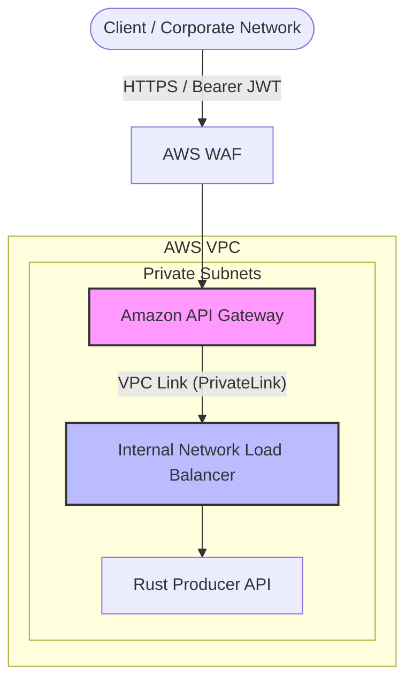

## 🛠️ Deployment Lifecycle (Amazon Elastic Kubernetes Service - EKS)

> **Before you start:** this guide assumes you already have an AWS account with
> a fully activated (non-free-tier) billing setup and approved GPU vCPU quota
> (the `G` and `P` on-demand instance families). If you haven't done that yet,
> go through [`aws_onboarding.md`](aws_onboarding.md) and
> [`aws_gpu_prereqs.md`](aws_gpu_prereqs.md) first. Note that the
> capacity-proof cluster built in Section 7 of `aws_gpu_prereqs.md` is
> disposable and unrelated to the cluster built below — delete it if you
> haven't already, this guide creates its own from scratch.

> **A note on GPUs:** unlike Azure and GCP, AWS does not offer a single-A100
> instance — the A100 only ships as the 8-GPU `p4d`/`p4de` nodes. To preserve
> the *one-GPU-per-pod* model this course uses, the vLLM inference tier runs on
> **`g6e.4xlarge`** (1× NVIDIA **L40S 48GB**). See
> [`cloud_comparison.md`](cloud_comparison.md) for the full instance mapping.

### 0. Prerequisites & Environment Variables

🔑 Authenticate AWS CLI Session

Before proceeding, ensure your AWS CLI session is authenticated and pointing at the correct account and region. This step is required for all subsequent resource creation commands.

```bash
export AWS_PROFILE=AccountName or aws configure          # set Access Key, Secret Key, and default region (eu-central-1)
aws sts get-caller-identity --output table
```

> Expected: the `Account` field matches your `$ACCOUNT_ID` and the caller ARN is the IAM principal you intend to use.

```bash
# --- Core Identifiers ---
export AWS_REGION="eu-central-1"
export ACCOUNT_ID="$(aws sts get-caller-identity --query Account --output text)"
export EKS_CLUSTER_NAME="eks-ocr-cluster"
export K8S_VERSION="1.31"
export ECR_REGISTRY="${ACCOUNT_ID}.dkr.ecr.${AWS_REGION}.amazonaws.com"
```

---

### 1. Infrastructure Setup: EKS & Storage

Unlike `az aks create` / `gcloud container clusters create` — which implicitly provision networking and identity — EKS requires you to bring your own **IAM roles**, **VPC/subnets**, and an **OIDC provider**. We create them explicitly below.

#### 1.1 IAM Roles

```bash
# 1. Cluster role (the EKS control plane assumes this)
cat > eks-cluster-trust.json <<'EOF'
{ "Version": "2012-10-17", "Statement": [
  { "Effect": "Allow", "Principal": { "Service": "eks.amazonaws.com" }, "Action": "sts:AssumeRole" } ] }
EOF

aws iam create-role \
  --role-name eksOcrClusterRole \
  --assume-role-policy-document file://eks-cluster-trust.json

aws iam attach-role-policy \
  --role-name eksOcrClusterRole \
  --policy-arn arn:aws:iam::aws:policy/AmazonEKSClusterPolicy

# 2. Node role (all managed node groups assume this)
cat > eks-node-trust.json <<'EOF'
{ "Version": "2012-10-17", "Statement": [
  { "Effect": "Allow", "Principal": { "Service": "ec2.amazonaws.com" }, "Action": "sts:AssumeRole" } ] }
EOF

aws iam create-role \
  --role-name eksOcrNodeRole \
  --assume-role-policy-document file://eks-node-trust.json

for POLICY in \
  AmazonEKSWorkerNodePolicy \
  AmazonEKS_CNI_Policy \
  AmazonEC2ContainerRegistryReadOnly \
  AmazonElasticFileSystemClientReadWriteAccess ; do
  aws iam attach-role-policy \
    --role-name eksOcrNodeRole \
    --policy-arn arn:aws:iam::aws:policy/${POLICY}
done
```

> **⚠️ `AmazonElasticFileSystemClientReadWriteAccess` on the node role is required for EFS.**
> When the EFS mount helper (`efs-utils`) on a node cannot resolve the filesystem's
> regional DNS name, it falls back to looking up the mount-target IP via
> `elasticfilesystem:DescribeMountTargets`. Without this policy the node role is
> denied that call and the mount fails with
> `User: ...eksOcrNodeRole... is not authorized to perform: elasticfilesystem:DescribeMountTargets`,
> leaving the ingestion pod stuck in `ContainerCreating`.

#### 1.2 VPC & Subnets

Deploy the official Amazon EKS VPC template (public + private subnets across two AZs), then capture the subnet and security-group IDs the cluster needs.

```bash
# 1. Create the VPC stack
aws cloudformation create-stack \
  --region $AWS_REGION \
  --stack-name eks-ocr-vpc \
  --template-url https://s3.us-west-2.amazonaws.com/amazon-eks/cloudformation/2020-10-29/amazon-eks-vpc-private-subnets.yaml

aws cloudformation wait stack-create-complete --stack-name eks-ocr-vpc --region $AWS_REGION

# 2. Enable DNS hostnames on the VPC (required for EFS mounts)
#    The EKS VPC template enables enableDnsSupport but NOT enableDnsHostnames.
#    Amazon EFS advertises a regional DNS name (fs-xxx.efs.<region>.amazonaws.com)
#    that only resolves when BOTH attributes are true — otherwise node mounts fail
#    with "Failed to resolve fs-xxx.efs...amazonaws.com".
export VPC_ID=$(aws cloudformation describe-stacks --stack-name eks-ocr-vpc \
  --query "Stacks[0].Outputs[?OutputKey=='VpcId'].OutputValue" --output text)
echo "VPC: $VPC_ID"   # keep this exported — later EFS/subnet steps reference $VPC_ID
aws ec2 modify-vpc-attribute --vpc-id $VPC_ID --enable-dns-hostnames

# 3. Capture outputs
export SUBNET_IDS=$(aws cloudformation describe-stacks --stack-name eks-ocr-vpc \
  --query "Stacks[0].Outputs[?OutputKey=='SubnetIds'].OutputValue" --output text)
export SECURITY_GROUP=$(aws cloudformation describe-stacks --stack-name eks-ocr-vpc \
  --query "Stacks[0].Outputs[?OutputKey=='SecurityGroups'].OutputValue" --output text)

# CloudFormation returns SubnetIds as a single comma-joined string
# (e.g. "subnet-aaa,subnet-bbb,..."). Split it into a real array so the
# commands below can expand it as separate arguments. In zsh an unquoted
# comma-joined string is NOT word-split, which is why passing $SUBNET_IDS
# straight to --subnets fails with "subnet ID ... does not exist".
SUBNET_ARR=(${(s:,:)SUBNET_IDS})   # zsh: split on comma

echo "Subnets (${#SUBNET_ARR[@]}): $SUBNET_ARR"
echo "Cluster SG: $SECURITY_GROUP"
```

#### 1.3 Create the EKS Cluster

```bash
# 1. Create the control plane
aws eks create-cluster \
  --region $AWS_REGION \
  --name $EKS_CLUSTER_NAME \
  --kubernetes-version $K8S_VERSION \
  --role-arn arn:aws:iam::${ACCOUNT_ID}:role/eksOcrClusterRole \
  --resources-vpc-config subnetIds=${SUBNET_IDS},securityGroupIds=${SECURITY_GROUP}

# 2. Wait for the control plane to become ACTIVE (~10 min)
aws eks wait cluster-active --name $EKS_CLUSTER_NAME --region $AWS_REGION

# 3. Download cluster credentials into kubeconfig
aws eks update-kubeconfig --region $AWS_REGION --name $EKS_CLUSTER_NAME
```

#### 1.4 Associate the OIDC Provider

The IAM OIDC provider lets pods assume IAM roles via **IRSA** (IAM Roles for Service Accounts). It is required for the EFS CSI driver and the AWS Load Balancer Controller later.

```bash
export OIDC_ID=$(aws eks describe-cluster --name $EKS_CLUSTER_NAME \
  --query "cluster.identity.oidc.issuer" --output text | sed 's|https://||')

aws iam create-open-id-connect-provider \
  --url https://${OIDC_ID} \
  --client-id-list sts.amazonaws.com \
  --thumbprint-list 9e99a48a9960b14926bb7f3b02e22da2b0ab7280
```

#### 1.5 Create Managed Node Groups

Five node groups. First an **untainted `systemnp` pool** for cluster add-ons (see the note below), then four workload pools mirroring the AKS/GKE layout. The two GPU groups use the EKS **GPU-optimized AMI** (`AL2023_x86_64_NVIDIA`), which pre-ships the NVIDIA drivers — we taint them with `nvidia.com/gpu=present:NoSchedule` (GKE-style) so only GPU workloads land there. The Redis and API groups use the standard AMI and custom `sku` taints plus `app` labels.

> **⚠️ Why a dedicated system pool?** AKS/GKE keep an implicit untainted system pool; raw `aws eks` does not. If *every* node group is tainted (as the four workload pools are), cluster add-ons that carry no tolerations — the **EFS CSI controller**, CoreDNS, KEDA, kube-prometheus-stack, the **AWS Load Balancer Controller** — have nowhere to schedule. Their pods stay `Pending`, the EFS addon reports `DEGRADED` (`InsufficientNumberOfReplicas`), and the model-weights PVC never binds. The small untainted `systemnp` pool gives these controllers a home.

```bash
NODE_ROLE=arn:aws:iam::${ACCOUNT_ID}:role/eksOcrNodeRole

# 4. System Node Group (untainted) - hosts cluster add-ons & controllers
aws eks create-nodegroup \
  --cluster-name $EKS_CLUSTER_NAME --region $AWS_REGION \
  --nodegroup-name systemnp \
  --node-role $NODE_ROLE --subnets $SUBNET_ARR \
  --instance-types m6i.large \
  --ami-type AL2023_x86_64_STANDARD \
  --scaling-config minSize=1,maxSize=2,desiredSize=1
  # no taints — add-ons (EFS CSI, CoreDNS, KEDA, LB controller) schedule here

# Wait for the system pool before installing addons that depend on it
aws eks wait nodegroup-active --cluster-name $EKS_CLUSTER_NAME \
  --region $AWS_REGION --nodegroup-name systemnp

# 5. GPU Node Group (L40S 48GB) - vLLM Inference Server
#    --disk-size 100: the ocr-vlm-qwen image is ~8 GB compressed but unpacks to
#    ~35 GB. The 20 GB EKS default fills the node's ephemeral-storage during image
#    extraction → DiskPressure → the pod is evicted in a loop and never starts.
aws eks create-nodegroup \
  --cluster-name $EKS_CLUSTER_NAME --region $AWS_REGION \
  --nodegroup-name gpunpa100 \
  --node-role $NODE_ROLE --subnets $SUBNET_ARR \
  --instance-types g6e.4xlarge \
  --ami-type AL2023_x86_64_NVIDIA \
  --disk-size 100 \
  --scaling-config minSize=0,maxSize=4,desiredSize=1 \
  --taints key=nvidia.com/gpu,value=present,effect=NO_SCHEDULE

# 6. GPU Node Group (T4 16GB) - Layout Consumer Worker
#    --disk-size 100: same reason — the ocr-worker-rt CUDA image is multi-GB
#    unpacked and won't fit the 20 GB default.
aws eks create-nodegroup \
  --cluster-name $EKS_CLUSTER_NAME --region $AWS_REGION \
  --nodegroup-name gpunpt4 \
  --node-role $NODE_ROLE --subnets $SUBNET_ARR \
  --instance-types g4dn.4xlarge \
  --ami-type AL2023_x86_64_NVIDIA \
  --disk-size 100 \
  --scaling-config minSize=0,maxSize=4,desiredSize=1 \
  --taints key=nvidia.com/gpu,value=present,effect=NO_SCHEDULE

# 7. High-Memory CPU Node Group (Redis State Store)
aws eks create-nodegroup \
  --cluster-name $EKS_CLUSTER_NAME --region $AWS_REGION \
  --nodegroup-name redisnp \
  --node-role $NODE_ROLE --subnets $SUBNET_ARR \
  --instance-types r6i.xlarge \
  --ami-type AL2023_x86_64_STANDARD \
  --scaling-config minSize=1,maxSize=3,desiredSize=1 \
  --labels app=redis-store \
  --taints key=sku,value=redis,effect=NO_SCHEDULE

# 8. CPU-Optimized Node Group (API Gateway Ingest)
aws eks create-nodegroup \
  --cluster-name $EKS_CLUSTER_NAME --region $AWS_REGION \
  --nodegroup-name apinp \
  --node-role $NODE_ROLE --subnets $SUBNET_ARR \
  --instance-types m6i.large \
  --ami-type AL2023_x86_64_STANDARD \
  --scaling-config minSize=1,maxSize=5,desiredSize=1 \
  --labels app=api-gateway \
  --taints key=sku,value=api,effect=NO_SCHEDULE
```

> **Note:** managed node groups automatically apply the label
> `eks.amazonaws.com/nodegroup=<name>`, which our GPU deployments use as their
> `nodeSelector` — no manual labeling required.

> **⚠️ Disk size is immutable on a managed node group.** `diskSize` can only be
> set at creation (there is no launch template here). If a GPU group was created
> with the 20 GB default and hits `DiskPressure`, you must **delete and recreate**
> the node group with `--disk-size 100` — recreating under the *same name*
> preserves the `eks.amazonaws.com/nodegroup=<name>` label the GPU `nodeSelector`
> relies on, so no manifest changes are needed.

> **⚠️ `InsufficientInstanceCapacity`.** `g6e.4xlarge` is capacity-constrained in
> some AZs (we hit it in `eu-central-1b`). If node creation fails with this error,
> pin `--subnets` to a subnet in an AZ that has capacity (e.g. the 1a private
> subnet) rather than passing all subnets.

#### 🛡️ GPU Lifecycle on EKS: Device Plugin

Because the `AL2023_x86_64_NVIDIA` AMI already contains the NVIDIA kernel drivers and container toolkit, we do **not** need the full GPU Operator (as AKS does to compile drivers). We only install the **NVIDIA device plugin**, which advertises `nvidia.com/gpu` capacity to the scheduler. It must tolerate the GPU taint, so we pass a values file.

```bash
# 1. Add the NVIDIA device-plugin Helm repo
helm repo add nvdp https://nvidia.github.io/k8s-device-plugin
helm repo update

# 2. Install the device plugin with taint tolerations
helm install nvidia-device-plugin nvdp/nvidia-device-plugin \
  --namespace kube-system \
  -f k8s/eks/infra/nvidia-device-plugin-values.yaml

# 3. Wait for the DaemonSet to roll out onto the GPU nodes
kubectl -n kube-system rollout status ds/nvidia-device-plugin
```

#### 🔍 Verify GPU Schedulability
To verify that the device plugin has reported `nvidia.com/gpu` capacity to Kubernetes:

```bash
# 1. Check GPU Capacity & Allocatable on nodes
kubectl get nodes "-o=custom-columns=NAME:.metadata.name,GPU_CAPACITY:.status.capacity.nvidia\.com/gpu,GPU_ALLOCATABLE:.status.allocatable.nvidia\.com/gpu"

# 2. Inspect node taints and allocatable resources
kubectl describe nodes | grep -A 5 "Allocatable" | grep "nvidia.com/gpu"

# 3. Verify node group labels
kubectl get nodes -L eks.amazonaws.com/nodegroup
```

> **Pro Tip:** If `GPU_ALLOCATABLE` shows `0` or `<none>`, the device plugin failed to schedule on those nodes. Re-check the tolerations in `k8s/eks/infra/nvidia-device-plugin-values.yaml` against the `nvidia.com/gpu=present:NoSchedule` taint applied to the GPU node groups.

---

### 📦 2. Model Ingestion: Datacenter‑to‑Datacenter

Models are treated as **heavy binary data**. Ingest them directly inside the cluster using a Kubernetes **Job** backed by an **Amazon EFS PVC**. EFS is required because both the ingestion Job and the downstream inference pods mount the volume simultaneously — this needs `ReadWriteMany` (RWX), which Amazon EBS does not support.

#### 2.1 Provision Storage (EFS + PVC)

First create an **IRSA role** for the CSI driver, install the addon *with that role*, create the filesystem, then apply the RWX StorageClass and PVC.

> **⚠️ The EFS CSI driver needs its own IAM role (IRSA).** In dynamic `efs-ap`
> mode the controller calls `elasticfilesystem:DescribeAccessPoints` /
> `CreateAccessPoint`. Without a role bound to its service account it falls back
> to the node's IMDS credentials — which lack EFS permissions — and provisioning
> fails with `no EC2 IMDS role found ... DescribeAccessPoints`, leaving the PVC
> `Pending`. This role is **separate from `eksOcrClusterRole`**: that one is
> trusted by the EKS *service* and carries only control-plane permissions; a pod
> cannot assume it. IRSA requires a role trusted by the cluster's **OIDC
> provider** (created in 1.4) and scoped to the `efs-csi-controller-sa` account.

```bash
# 1. Create the IRSA role for the EFS CSI controller
export OIDC_ID=$(aws eks describe-cluster --name $EKS_CLUSTER_NAME \
  --query "cluster.identity.oidc.issuer" --output text | sed 's|https://||')

cat > efs-csi-trust.json <<EOF
{ "Version": "2012-10-17", "Statement": [{
  "Effect": "Allow",
  "Principal": { "Federated": "arn:aws:iam::${ACCOUNT_ID}:oidc-provider/${OIDC_ID}" },
  "Action": "sts:AssumeRoleWithWebIdentity",
  "Condition": { "StringEquals": {
    "${OIDC_ID}:sub": "system:serviceaccount:kube-system:efs-csi-controller-sa",
    "${OIDC_ID}:aud": "sts.amazonaws.com"
  } }
}] }
EOF

aws iam create-role --role-name eksOcrEfsCsiRole \
  --assume-role-policy-document file://efs-csi-trust.json
aws iam attach-role-policy --role-name eksOcrEfsCsiRole \
  --policy-arn arn:aws:iam::aws:policy/service-role/AmazonEFSCSIDriverPolicy

# 2. Install the EFS CSI driver addon WITH the IRSA role attached
aws eks create-addon \
  --cluster-name $EKS_CLUSTER_NAME --region $AWS_REGION \
  --addon-name aws-efs-csi-driver \
  --service-account-role-arn arn:aws:iam::${ACCOUNT_ID}:role/eksOcrEfsCsiRole

# (If the addon already exists without a role, attach it instead:)
#   aws eks update-addon --cluster-name $EKS_CLUSTER_NAME --region $AWS_REGION \
#     --addon-name aws-efs-csi-driver --resolve-conflicts OVERWRITE \
#     --service-account-role-arn arn:aws:iam::${ACCOUNT_ID}:role/eksOcrEfsCsiRole
#   kubectl -n kube-system rollout restart deploy/efs-csi-controller

# 3. Create the EFS filesystem in the cluster VPC
export EFS_ID=$(aws efs create-file-system \
  --region $AWS_REGION \
  --performance-mode generalPurpose \
  --throughput-mode elastic \
  --tags Key=Name,Value=eks-ocr-model-weights \
  --query FileSystemId --output text)
echo "EFS filesystem: $EFS_ID"

# 4. Create a mount target in each private subnet
for SUBNET in $SUBNET_ARR; do
  aws efs create-mount-target \
    --file-system-id $EFS_ID \
    --subnet-id $SUBNET \
    --security-groups $SECURITY_GROUP
done

> **⚠️ EFS needs a mount target in *every* AZ a pod can land in.** A mount target
> is per-AZ: a pod on a node in an AZ with no mount target fails to start with
> `MountVolume.SetUp failed ... No matching mount target in the az eu-central-1X.
> Available mount target(s) are in az [...]`. This bites when a GPU node group
> spans multiple AZs (or is later pinned to a new AZ to dodge
> `InsufficientInstanceCapacity`) but EFS only has a mount target in the original
> AZ. Fix: add the missing one (idempotent) —
> `aws efs create-mount-target --file-system-id $EFS_ID --subnet-id <private-subnet-in-that-az> --security-groups $SECURITY_GROUP`.
> The kubelet retries the mount, so the pending pod recovers once the target is
> `available`. Looping over `$SUBNET_ARR` above covers this only if that array
> includes a private subnet in each AZ your node groups use.

# 5. Allow inbound NFS (TCP 2049) into the mount-target SG so nodes can mount EFS.
#    IMPORTANT: EKS managed nodes do NOT use the CloudFormation SG — they attach
#    the EKS-managed *cluster security group*. The NFS rule must therefore allow
#    2049 FROM that cluster SG, not from $SECURITY_GROUP. Using the wrong source
#    lets DNS resolve but the mount times out with
#    "rpc error: code = DeadlineExceeded desc = context deadline exceeded".
export CLUSTER_SG=$(aws eks describe-cluster --name $EKS_CLUSTER_NAME --region $AWS_REGION \
  --query "cluster.resourcesVpcConfig.clusterSecurityGroupId" --output text)
echo "EKS cluster SG (attached to nodes): $CLUSTER_SG"

aws ec2 authorize-security-group-ingress --group-id $SECURITY_GROUP \
  --protocol tcp --port 2049 --source-group $CLUSTER_SG --region $AWS_REGION \
  2>/dev/null || echo "NFS/2049 ingress rule (from cluster SG) already present"

# 6. Point the StorageClass at the filesystem and apply it
sed "s|<EFS_FILE_SYSTEM_ID>|$EFS_ID|" k8s/eks/infra/efs-storageclass.yaml | kubectl apply -f -

# 7. Apply the PVC
kubectl apply -f k8s/eks/infra/provisioning/pvc.yaml

# 8. Verify status is 'Bound' (may take ~30s while the access point is created)
kubectl get pvc model-weights-pvc
```

**Expected Output:**
```text
NAME                STATUS   VOLUME                                     CAPACITY   ACCESS MODES   STORAGECLASS   AGE
model-weights-pvc   Bound    pvc-8192a3b1-12c4-4ef5-98de-f7fe61b13adb   300Gi      RWX            efs-sc         31s
```

#### 2.2 Launch the Ingestion Job

```bash
# Launch the ingestion job
kubectl apply -f k8s/eks/infra/provisioning/ingest-job.yaml

# Confirm job execution
kubectl get job model-weight-ingest
```

#### 2.3 Observe Progress

If the pod is still `ContainerCreating` / `Pending`, check **events** first — `logs` only works once the container is running:

```bash
# Events: scheduling & volume-mount status (why the pod hasn't started yet)
kubectl describe pod -l job-name=model-weight-ingest | sed -n '/Events/,$p'
```

Once the pod is `Running`, follow the download **logs** (the app's stdout) directly from Hugging Face:

```bash
kubectl logs -f job/model-weight-ingest
```

> **Events vs. logs:** events come from the kubelet/scheduler and cover the pod
> *lifecycle before the app runs* (scheduling, image pull, EFS mount) — that's
> where `FailedMount` / `FailedScheduling` show up. Logs are the container's own
> stdout, available only after it starts. `ContainerCreating` = not started yet →
> use events.

*(Once you see `✅ Ingestion complete`, clean up the job with `kubectl delete job model-weight-ingest`)*

#### 2.4 Debugging & Manual Inspection (Optional)

```bash
kubectl run weights-debug \
  --rm -it \
  --image=ubuntu:22.04 \
  --overrides='
{
  "spec": {
    "containers": [{
      "name": "debug",
      "image": "ubuntu:22.04",
      "command": ["bash"],
      "stdin": true,
      "tty": true,
      "volumeMounts": [{
        "name": "weights",
        "mountPath": "/mnt/models"
      }]
    }],
    "volumes": [{
      "name": "weights",
      "persistentVolumeClaim": {
        "claimName": "model-weights-pvc"
      }
    }]
  }
}'
```

---

### 📦 3. Build & Push Container Images

You need the three images in ECR as **`linux/amd64`** (the arch of the EKS GPU
nodes). Pick one path:

- **Option 1 — Build locally**, then push. Simple, but slow on Apple Silicon:
  a Mac builds `arm64` by default, so you must cross-build with
  `--platform linux/amd64` under QEMU emulation.
- **Option 2 — Build on AWS CodeBuild.** The build runs in the cloud on native
  amd64 agents and pushes straight to ECR — nothing builds on your machine.
  This is the AWS equivalent of `az acr build`. (Unlike Azure's ACR, **ECR is a
  registry only and cannot build images** — see
  [`feature_comments.md`](feature_comments.md).)

#### Option 1 — Local build & push

```bash
# 1. Create the ECR repositories (one per image)
for REPO in ocr-vlm-qwen ocr-api-rust ocr-worker-rt ; do
  aws ecr create-repository --repository-name $REPO --region $AWS_REGION || true
done

# 2. Authenticate Docker against ECR
aws ecr get-login-password --region $AWS_REGION | \
  docker login --username AWS --password-stdin $ECR_REGISTRY

# 3. Build and push vLLM Inference Server (--platform: EKS nodes are x86_64)
docker buildx build --platform linux/amd64 -t ${ECR_REGISTRY}/ocr-vlm-qwen:latest --push ./server

# 4. Build and push Rust Producer API Gateway
docker buildx build --platform linux/amd64 -t ${ECR_REGISTRY}/ocr-api-rust:latest --push ./client_rt_producer

# 5. Build and push Python Consumer Worker
docker buildx build --platform linux/amd64 -t ${ECR_REGISTRY}/ocr-worker-rt:latest --push ./client_rt_consumer
```

> On an Apple-Silicon Mac these cross-builds run under QEMU emulation and are
> slow (the CUDA-heavy `ocr-vlm-qwen` and `ocr-worker-rt` especially). If you
> hit that wall, use Option 2.

#### Option 2 — Build on AWS CodeBuild (no local build)

The build runs on AWS and pushes to ECR for you. Three committed files drive it:
- [`buildspec.yml`](../buildspec.yml) — the build recipe (ECR login, create
  repos, build all three images, push).
- [`k8s/eks/codebuild-setup.sh`](../k8s/eks/codebuild-setup.sh) — one-time
  creation of the IAM service role + CodeBuild project (`SOURCE_TYPE=GITHUB|S3`;
  for S3 it also creates the source bucket + grants the role read access).
- [`k8s/eks/codebuild-upload-source.sh`](../k8s/eks/codebuild-upload-source.sh) —
  zips the working tree and uploads it to the S3 source bucket (S3 path only).

The project can pull the source from **GitHub** or from **S3** — pick one.

**2a — GitHub source** (default). Requires your GitHub account connected to
CodeBuild first (Console → Developer Tools → Settings → Connections, or
`aws codebuild import-source-credentials`):

```bash
# 1. One-time: create the IAM role + CodeBuild project (GitHub source)
./k8s/eks/codebuild-setup.sh

# 2. Launch a cloud build (builds + pushes all three images to ECR)
aws codebuild start-build --project-name ocr-image-build --region $AWS_REGION \
  --query 'build.id' --output text
```

**2b — S3 source** (no GitHub / OAuth). The build pulls a zip of the repo from
an S3 bucket. Use this if you don't want to wire up GitHub. (`NO_SOURCE` won't
work — the build needs the repo contents.)

```bash
# 1. One-time: create the IAM role + CodeBuild project + source bucket
SOURCE_TYPE=S3 ./k8s/eks/codebuild-setup.sh

# 2. Package the working tree and upload it (re-run before every build)
./k8s/eks/codebuild-upload-source.sh

# 3. Launch a cloud build
aws codebuild start-build --project-name ocr-image-build --region $AWS_REGION \
  --query 'build.id' --output text
```

**Monitor** (either source):

```bash
# Stream the build log to your terminal
aws logs tail /aws/codebuild/ocr-image-build --follow --region $AWS_REGION

# …or poll status for a specific build id
aws codebuild batch-get-builds --ids <BUILD_ID> --region $AWS_REGION \
  --query 'builds[0].{phase:currentPhase,status:buildStatus}'
```

**Verify the images landed in ECR** once the build reports `SUCCEEDED`:

```bash
for REPO in ocr-vlm-qwen ocr-api-rust ocr-worker-rt ; do
  aws ecr describe-images --repository-name $REPO --region $AWS_REGION \
    --query 'sort_by(imageDetails,&imagePushedAt)[-1].{tags:imageTags,pushed:imagePushedAt}'
done
```

> **Verified path (S3 source).** End-to-end run: setup → upload → `start-build`
> succeeded in ~19 min (BUILD ~8 min, image pushes ~10 min), producing all three
> `:latest` images in `<account>.dkr.ecr.eu-central-1.amazonaws.com`. Because S3
> is a static snapshot, **re-run `codebuild-upload-source.sh` after any code
> change** — otherwise the build reuses the previously uploaded zip.

> The default CodeBuild `LINUX_CONTAINER` image is **amd64**, so the images are
> EKS-compatible with no `--platform` flag. `privilegedMode` is enabled in the
> project because `docker build` needs Docker-in-Docker. The vLLM image is large;
> `codebuild-setup.sh` uses `BUILD_GENERAL1_LARGE` for the extra disk/RAM (bump to
> `BUILD_GENERAL1_2XLARGE` if `docker build` runs out of disk).

> To build the **slim** variants instead, point the buildspec at the slim
> Dockerfiles (e.g. `docker build -f server/Dockerfile.slim ...`).

---

### 4. Deploy the Full Stack on EKS

> **Note:** the deployment manifests under `k8s/eks/apps/` reference images by
> bare name (`ocr-api-rust:latest`, …). The account-specific ECR registry is
> injected at apply time by the Kustomize `images:` transformer, so no AWS
> account ID is committed. `deploy.sh` (Step 3 below) rewrites the registry from
> `aws sts get-caller-identity` via `kustomize edit set image`, applies, then
> restores the committed `PLACEHOLDER`. This requires the standalone
> [`kustomize` CLI](https://kubectl.docs.kubernetes.io/installation/kustomize/)
> in addition to `kubectl`.


```bash
# 1. Install KEDA (Kubernetes Event-driven Autoscaling)
helm repo add kedacore https://kedacore.github.io/charts
helm upgrade --install keda kedacore/keda -n keda --create-namespace

# 2. Install Prometheus Stack (Required for vLLM & Redis metrics)
helm repo add prometheus-community https://prometheus-community.github.io/helm-charts
helm repo update

kubectl create namespace monitoring
helm install prometheus prometheus-community/kube-prometheus-stack \
  --namespace monitoring \
  --set prometheus.prometheusSpec.serviceMonitorSelectorNilUsesHelmValues=false \
  --set grafana.enabled=true

# 3. Deploy EKS Microservices Stack
#    deploy.sh injects the ECR registry from your AWS account, applies, then
#    restores the committed PLACEHOLDER so no account ID is left in the tree.
./k8s/eks/deploy.sh
```

> **⚠️ Size the vLLM batch budget to the GPU you actually have.** The vLLM args
> live in the `ocr-pipeline-config` ConfigMap (`k8s/eks/kustomization.yml`
> `configMapGenerator`). `MAX_NUM_BATCHED_TOKENS` sets both the prefill batch and
> the multimodal **encoder-cache budget**, and that memory is reserved *on top of*
> the `GPU_MEMORY` fraction. A value like `262144` fits an 80 GB A100 but OOMs the
> 48 GB L40S (`g6e.4xlarge`) during cudagraph capture:
> `torch.OutOfMemoryError: CUDA out of memory. Tried to allocate 4.50 GiB … GPU 0
> has a total capacity of 44.39 GiB of which 1.93 GiB is free`. The pod then
> `CrashLoopBackOff`s (the startup probe's `connection refused` is a *symptom*, not
> the cause — read the container logs). For the L40S we use
> `MAX_NUM_BATCHED_TOKENS=16384` (= `MAX_MODEL_LEN`), `GPU_MEMORY=0.85`, and
> `MAX_NUM_SEQS=256`. (The node group is named `gpunpa100` for historical reasons
> but runs an L40S, not an A100 — don't let the name mislead the sizing.)

> **⚠️ The vLLM Deployment uses `strategy: Recreate`.** Only one GPU node is
> available, so a default rolling update deadlocks: it holds the old pod while the
> surge pod waits for a GPU that never frees up (new pod `Pending`, old pod never
> terminated). `Recreate` (set in `k8s/eks/apps/deployment-vlm.yml`) tears the old
> pod down first. If you change vLLM config and the rollout hangs with two pods,
> this is why.

---

### 5. End-to-End Testing & Validation

#### Inspect Logs
```bash
# 1. Producer API Gateway (apinp)
kubectl logs -l app=ocr-api --tail=100 -f

# 2. Consumer Worker (Layout Engine on T4 GPU - gpunpt4)
kubectl logs -l app=ocr-worker-rt --tail=100 -f

# 3. vLLM Server (Inference Engine on L40S GPU - gpunpa100)
kubectl logs -l app=ocr-vlm --tail=100 -f
```

#### Verify Metrics & Scaling
Check if the metrics are flowing to Prometheus (it may take 2-3 minutes for the first scrape).

The kube-prometheus-stack chart names the Prometheus pod
`prometheus-prometheus-kube-prometheus-prometheus-0` (not `prometheus-prometheus-0`)
and runs two containers, so resolve the name dynamically and target the
`prometheus` container explicitly:

```bash
# Resolve the actual Prometheus pod name (avoids hardcoding the chart's long name)
PROM_POD=$(kubectl get pods -n monitoring \
  -l app.kubernetes.io/name=prometheus \
  -o jsonpath='{.items[0].metadata.name}')

# Check T4 GPU Utilization
kubectl exec -it -n monitoring "$PROM_POD" -c prometheus -- \
  promtool query instant http://localhost:9090 "avg(DCGM_FI_DEV_GPU_UTIL)"

# Check L40S vLLM Waiting Requests
kubectl exec -it -n monitoring "$PROM_POD" -c prometheus -- \
  promtool query instant http://localhost:9090 "sum(vllm:num_requests_waiting)"
```

> **⚠️ Empty result ≠ broken query.** Both metrics only produce series if
> Prometheus is actually scraping their source:
> - `DCGM_FI_DEV_GPU_UTIL` requires a **DCGM exporter** DaemonSet (+ ServiceMonitor).
>   The NVIDIA device plugin alone exports no GPU telemetry.
> - `vllm:num_requests_waiting` requires a **ServiceMonitor** pointing at the vLLM
>   pod's `:8000/metrics` endpoint (vLLM exposes the series; it just isn't scraped).
>
> A **fresh cluster has neither**, so both queries come back empty even with pods
> Running and traffic flowing. Wire them up with the manifests below.

##### Wire up the scrape targets
The kube-prometheus-stack Prometheus selects any `ServiceMonitor` labelled
`release: prometheus`. Two manifests supply the missing targets:

```bash
# 1. vLLM queue-depth metric (drives the prometheus-based KEDA trigger)
kubectl apply -f k8s/eks/monitoring/vllm-servicemonitor.yml

# 2. GPU telemetry: DCGM exporter DaemonSet on the GPU node groups + its monitor
kubectl apply -f k8s/eks/monitoring/dcgm-exporter.yml
```

Give Prometheus one scrape interval (~15–30 s), then confirm the targets are UP
and the series exist:
```bash
# Both should now return a value (0 when idle is correct — not empty)
kubectl exec -it -n monitoring "$PROM_POD" -c prometheus -- \
  promtool query instant http://localhost:9090 "avg(DCGM_FI_DEV_GPU_UTIL)"
kubectl exec -it -n monitoring "$PROM_POD" -c prometheus -- \
  promtool query instant http://localhost:9090 "sum(vllm:num_requests_waiting)"
```

> **Notes on the manifests:**
> - The DCGM DaemonSet tolerates the `nvidia.com/gpu=present:NoSchedule` taint and
>   pins to the `gpunpa100` / `gpunpt4` node groups. It exposes all GPUs via
>   `NVIDIA_VISIBLE_DEVICES=all` **without** requesting a schedulable `nvidia.com/gpu`,
>   so it never steals a GPU from vLLM/the worker. Bump the image tag if your driver
>   needs a newer DCGM build.
> - The vLLM ServiceMonitor selects `ocr-vlm-service` by its `app: ocr-vlm` label on
>   the named `http` port — both added in `apps/deployment-vlm.yml`.
> - The KEDA vLLM trigger queries `sum(vllm:num_requests_waiting)` with **no**
>   namespace filter, because the operator labels the series `namespace` (not
>   `kubernetes_namespace`); an explicit `kubernetes_namespace` filter matches nothing.

---

### 6. Enterprise Exposure: Amazon API Gateway & WAF

Exposing raw Kubernetes services directly to the public internet creates security risks and uncontrolled autoscaling costs. On AWS, we establish a **Zero-Trust Network Perimeter** using an internal Network Load Balancer fronted by **Amazon API Gateway** (with a private VPC Link) and **AWS WAF**.

#### 🛡️ Architecture & Security: Why API Gateway + VPC Link?

By default, exposing Kubernetes services via a public LoadBalancer introduces DDoS, brute-force, and unauthorized-consumption risks — plus the financial risk of runaway KEDA scale-out on the expensive L40S/T4 node pools. To build a zero-trust perimeter around the OCR pipeline:



##### Core Isolation Components:

1. **Private Load Balancing**: The `ocr-api-service` is annotated with
   `service.beta.kubernetes.io/aws-load-balancer-scheme: "internal"`, so the AWS
   Load Balancer Controller provisions an **internal NLB** with a private IP
   inside the VPC — never a public-facing address.
2. **Private API Gateway Integration**: API Gateway reaches the internal NLB
   through a **VPC Link** (AWS PrivateLink). The backend never traverses the
   public internet; only the gateway is internet-facing, and every request is
   authenticated, throttled, and filtered first.
3. **Defense-in-Depth with AWS WAF**: A **Web ACL** is attached to the API
   Gateway stage to mitigate OWASP Top 10 threats (SQLi, XSS, bad bots) and
   apply IP allow/deny lists before traffic reaches the gateway.

#### 1. Install the AWS Load Balancer Controller
The controller reconciles the internal NLB from the service annotations. It requires IRSA (the OIDC provider from Section 1.4).

> **⚠️ Don't skip the IAM + ServiceAccount steps.** We install the chart with
> `serviceAccount.create=false`, so the controller's IAM policy, IRSA role, **and
> the ServiceAccount itself** must exist *first*. If the ServiceAccount is
> missing, the Deployment can never create pods (`ReplicaFailure: FailedCreate …
> serviceaccount not found`) → the admission webhook has **zero endpoints** →
> **every `Service`/`kubectl apply` fails** with:
> ```
> Internal error occurred: failed calling webhook "mservice.elbv2.k8s.aws":
>   … no endpoints available for service "aws-load-balancer-webhook-service"
> ```

```bash
export OIDC_ID=$(aws eks describe-cluster --name $EKS_CLUSTER_NAME \
  --query "cluster.identity.oidc.issuer" --output text | sed 's|https://||')
export VPC_ID=$(aws eks describe-cluster --name $EKS_CLUSTER_NAME \
  --query "cluster.resourcesVpcConfig.vpcId" --output text)

# 1. Create the IAM policy (official doc, pin to the controller version you run)
curl -fsSL -o iam_policy.json \
  https://raw.githubusercontent.com/kubernetes-sigs/aws-load-balancer-controller/v3.5.0/docs/install/iam_policy.json
aws iam create-policy --policy-name AWSLoadBalancerControllerIAMPolicy \
  --policy-document file://iam_policy.json || true

# 2. Create the IRSA role trusted by the OIDC provider + the SA below
cat > lbc-trust.json <<EOF
{ "Version": "2012-10-17", "Statement": [{
  "Effect": "Allow",
  "Principal": { "Federated": "arn:aws:iam::${ACCOUNT_ID}:oidc-provider/${OIDC_ID}" },
  "Action": "sts:AssumeRoleWithWebIdentity",
  "Condition": { "StringEquals": {
    "${OIDC_ID}:aud": "sts.amazonaws.com",
    "${OIDC_ID}:sub": "system:serviceaccount:kube-system:aws-load-balancer-controller"
  } } }] }
EOF
aws iam create-role --role-name AmazonEKSLoadBalancerControllerRole-$EKS_CLUSTER_NAME \
  --assume-role-policy-document file://lbc-trust.json || true
aws iam attach-role-policy --role-name AmazonEKSLoadBalancerControllerRole-$EKS_CLUSTER_NAME \
  --policy-arn arn:aws:iam::${ACCOUNT_ID}:policy/AWSLoadBalancerControllerIAMPolicy

# 3. Create the annotated ServiceAccount (chart is installed with create=false)
kubectl create sa aws-load-balancer-controller -n kube-system --dry-run=client -o yaml | kubectl apply -f -
kubectl annotate sa aws-load-balancer-controller -n kube-system --overwrite \
  eks.amazonaws.com/role-arn=arn:aws:iam::${ACCOUNT_ID}:role/AmazonEKSLoadBalancerControllerRole-$EKS_CLUSTER_NAME

# 4. Install the controller. Pass region + vpcId explicitly: EKS enforces an
#    IMDSv2 hop limit that stops pods reaching instance metadata, so without
#    these the controller crashes with "failed to get VPC ID … context deadline
#    exceeded".
helm repo add eks https://aws.github.io/eks-charts
helm repo update
helm install aws-load-balancer-controller eks/aws-load-balancer-controller \
  -n kube-system \
  --set clusterName=$EKS_CLUSTER_NAME \
  --set serviceAccount.create=false \
  --set serviceAccount.name=aws-load-balancer-controller \
  --set region=$AWS_REGION \
  --set vpcId=$VPC_ID

# 5. Verify: 2 pods Running and the webhook has endpoints before deploying Services
kubectl -n kube-system get pods -l app.kubernetes.io/name=aws-load-balancer-controller
kubectl -n kube-system get endpoints aws-load-balancer-webhook-service
```

The internal NLB is provisioned automatically because `k8s/eks/networking/service.yml` already carries the annotations:

```yaml
metadata:
  annotations:
    service.beta.kubernetes.io/aws-load-balancer-type: "external"
    service.beta.kubernetes.io/aws-load-balancer-nlb-target-type: "ip"
    service.beta.kubernetes.io/aws-load-balancer-scheme: "internal"
```

#### 2. Retrieve the Internal Load Balancer DNS
```bash
export NLB_DNS=$(kubectl get svc ocr-api-service \
  -o jsonpath='{.status.loadBalancer.ingress[0].hostname}')
echo "Private API NLB: $NLB_DNS"
```

#### 3. Create a Private API Gateway with a VPC Link
Create a **VPC Link** to the internal NLB, then an **HTTP API** that maps `POST /ocr/process` to the NLB listener. Protect it with a **JWT authorizer** (Cognito / any OIDC issuer) for identity and **stage/route throttling** for rate limiting.

> **⚠️ HTTP APIs do not support API keys or usage plans.** Those are a **REST API**
> (`aws apigateway`, v1) feature. This guide uses an **HTTP API**
> (`aws apigatewayv2`, v2), so auth is a **JWT authorizer** (or a Lambda authorizer)
> with the `Authorization: Bearer <token>` header — not `x-api-key`. Rate limiting
> comes from stage-level `DefaultRouteSettings` / per-route throttling instead of
> per-key quotas.

```bash
# 1. Create a VPC Link targeting the private subnets + cluster SG
export VPC_LINK_ID=$(aws apigatewayv2 create-vpc-link \
  --name ocr-vpc-link \
  --subnet-ids $SUBNET_ARR \
  --security-group-ids $SECURITY_GROUP \
  --query VpcLinkId --output text)

# 2. Create the HTTP API
export API_ID=$(aws apigatewayv2 create-api \
  --name ocr-http-api --protocol-type HTTP \
  --query ApiId --output text)

# 3. Integrate the API with the internal NLB via the VPC Link, create the
#    POST /ocr/process route, and deploy an auto-deploying $default stage.
#
#    $LISTENER_ARN is the NLB listener the ocr-api-service exposes (port 80).
#    Look it up from the NLB created by the LoadBalancer Service:
export LISTENER_ARN=$(aws elbv2 describe-listeners \
  --load-balancer-arn $(aws elbv2 describe-load-balancers \
    --query "LoadBalancers[?DNSName=='${NLB_DNS}'].LoadBalancerArn" --output text) \
  --query 'Listeners[0].ListenerArn' --output text)

# NOTE ON PATHS: the public route is POST /ocr/process, but the Rust API only
# serves POST /process (see client_rt_producer/src/main.rs). HTTP_PROXY forwards
# the request path verbatim, so without a rewrite the backend gets /ocr/process
# and returns 404 (silently — the API has no request-logging middleware). The
# `overwrite:path=/process` parameter mapping rewrites the backend path so the
# nice public URL keeps working. Drop it only if you rename the app route to match.
export INTEGRATION_ID=$(aws apigatewayv2 create-integration \
  --api-id $API_ID \
  --integration-type HTTP_PROXY \
  --integration-method POST \
  --connection-type VPC_LINK \
  --connection-id $VPC_LINK_ID \
  --integration-uri $LISTENER_ARN \
  --payload-format-version 1.0 \
  --request-parameters 'overwrite:path=/process' \
  --query IntegrationId --output text)

export ROUTE_ID=$(aws apigatewayv2 create-route \
  --api-id $API_ID \
  --route-key 'POST /ocr/process' \
  --target "integrations/${INTEGRATION_ID}" \
  --query RouteId --output text)

# Auto-deploying $default stage: no explicit path segment in the invoke URL.
aws apigatewayv2 create-stage \
  --api-id $API_ID --stage-name '$default' --auto-deploy

# 4. Create the identity provider the authorizer will trust. This example uses a
#    Cognito user pool + app client (any OIDC/JWT issuer works — skip this block
#    if you already have one and just set JWT_ISSUER / JWT_AUDIENCE by hand).
#
#    ALLOW_USER_PASSWORD_AUTH is what lets `cognito-idp initiate-auth` (below, in
#    "Getting a token") mint a token with a username/password. Drop it for
#    production and front the pool with a proper OAuth flow.
export USER_POOL_ID=$(aws cognito-idp create-user-pool \
  --pool-name ocr-user-pool \
  --query 'UserPool.Id' --output text)

export APP_CLIENT_ID=$(aws cognito-idp create-user-pool-client \
  --user-pool-id "$USER_POOL_ID" \
  --client-name ocr-api-client \
  --explicit-auth-flows ALLOW_USER_PASSWORD_AUTH ALLOW_REFRESH_TOKEN_AUTH \
  --query 'UserPoolClient.ClientId' --output text)

# Create a test user and give it a permanent password so initiate-auth succeeds
# (the --permanent flag skips the FORCE_CHANGE_PASSWORD challenge).
aws cognito-idp admin-create-user \
  --user-pool-id "$USER_POOL_ID" --username api-user \
  --message-action SUPPRESS >/dev/null
aws cognito-idp admin-set-user-password \
  --user-pool-id "$USER_POOL_ID" --username api-user \
  --password 'ChangeMe!2026' --permanent

# 5. Create a JWT authorizer. The issuer is the user-pool URL; the audience is
#    the app-client ID that mints tokens (both derived from the block above).
export JWT_ISSUER="https://cognito-idp.${AWS_REGION}.amazonaws.com/${USER_POOL_ID}"
export JWT_AUDIENCE="${APP_CLIENT_ID}"
export AUTHORIZER_ID=$(aws apigatewayv2 create-authorizer \
  --api-id $API_ID \
  --name ocr-jwt-authorizer \
  --authorizer-type JWT \
  --identity-source '$request.header.Authorization' \
  --jwt-configuration "Issuer=${JWT_ISSUER},Audience=${JWT_AUDIENCE}" \
  --query AuthorizerId --output text)

# 6. Attach the authorizer to the POST /ocr/process route so every call must
#    present a valid Bearer token. ($ROUTE_ID is from create-route in step 3.)
aws apigatewayv2 update-route \
  --api-id $API_ID --route-id $ROUTE_ID \
  --authorization-type JWT \
  --authorizer-id $AUTHORIZER_ID

# 7. Rate-limit at the stage (HTTP APIs throttle here, not via usage plans).
aws apigatewayv2 update-stage \
  --api-id $API_ID --stage-name '$default' \
  --default-route-settings ThrottlingBurstLimit=10,ThrottlingRateLimit=5
```

#### 4. Access Control & Governance

Access is controlled with a **JWT authorizer** on the HTTP API:

*   **Zero-Trust JWT**: Validate corporate identities with a **Cognito** user pool (or any OIDC/JWT issuer). Every request carries `Authorization: Bearer <token>`; the gateway rejects missing/expired/invalid tokens before they ever reach the VPC Link.
*   **Lambda authorizer (alternative)**: For custom logic — e.g. mapping a partner's opaque token to identity, or per-tenant checks — use a `REQUEST`-type Lambda authorizer instead of the JWT type.

**Governance Features:**
*   **Indirect GPU Protection**: Stage/route throttling (`ThrottlingBurstLimit` / `ThrottlingRateLimit`) prevents high-volume bursts from triggering expensive KEDA scale-out events on the L40S/T4 nodes.
*   **Tiered Access**: Use JWT **scopes/claims** (or separate routes with their own route-level throttle settings) to differentiate consumers — e.g. a `premium` scope routed to a higher rate limit.

**Getting a token (Cognito example):** authenticate an app-client user and read the `IdToken` (or `AccessToken`) from the response:
```bash
TOKEN=$(aws cognito-idp initiate-auth \
  --auth-flow USER_PASSWORD_AUTH \
  --client-id "$JWT_AUDIENCE" \
  --auth-parameters USERNAME=api-user,PASSWORD='ChangeMe!2026' \
  --query 'AuthenticationResult.IdToken' --output text)
```

**Example Request with Bearer JWT:**
```bash
curl -X POST "https://${API_ID}.execute-api.${AWS_REGION}.amazonaws.com/ocr/process" \
     -H "Authorization: Bearer $TOKEN" \
     -F "file=@invoice.pdf"
```

---

### 7. Monitoring & Dashboards (Grafana)

1. **Port-forward Grafana**:
   ```bash
   kubectl port-forward -n monitoring svc/prometheus-grafana 3000:80
   ```
2. **Retrieve Admin Password**:
   ```bash
   kubectl get secret -n monitoring prometheus-grafana -o jsonpath="{.data.admin-password}" | base64 --decode ; echo
   ```
3. Open `http://localhost:3000` (User: `admin`).

---

### 8. Scaling Lifecycle & Cost Control

GPU nodes dominate the cost of this stack, so idle capacity should collapse to zero and only warm up on demand. Two layers cooperate: **KEDA** scales the *deployments* (pods) from app-level signals, and the **EKS node groups** scale the *nodes* underneath them.

#### Scale the GPU node groups to zero

Drop the GPU node groups to a minimum of zero so they drain when the cluster is idle:

```bash
aws eks update-nodegroup-config \
  --cluster-name $EKS_CLUSTER_NAME --region $AWS_REGION \
  --nodegroup-name gpunpa100 \
  --scaling-config minSize=0,maxSize=4,desiredSize=0

aws eks update-nodegroup-config \
  --cluster-name $EKS_CLUSTER_NAME --region $AWS_REGION \
  --nodegroup-name gpunpt4 \
  --scaling-config minSize=0,maxSize=4,desiredSize=0
```

#### Pause autoscaling, then hand it back

To hold a deployment at a fixed size — e.g. keep vLLM warm at 1 replica and stop KEDA scaling it to 0 — pin it with the `paused-replicas` annotation:

```bash
# Pin vLLM and the T4 worker at 1 replica (KEDA stops scaling them)
kubectl annotate scaledobject ocr-vlm-scaler \
  autoscaling.keda.sh/paused-replicas="1" --overwrite
kubectl annotate scaledobject ocr-worker-rt-scaler \
  autoscaling.keda.sh/paused-replicas="1" --overwrite
```

Remove the pin to return control to the cron/metric triggers:

```bash
kubectl annotate scaledobject ocr-vlm-scaler       autoscaling.keda.sh/paused-replicas-
kubectl annotate scaledobject ocr-worker-rt-scaler autoscaling.keda.sh/paused-replicas-
```

> A `paused-replicas` annotation set manually is **not** in git, so it survives re-apply (`./k8s/eks/deploy.sh` or `kubectl apply -k k8s/eks`) — remove it with the command above to hand scaling back to the triggers. While paused, the KEDA-managed HPA (`keda-hpa-<name>`) is deleted; removing the annotation recreates it.

#### How the triggers work (in brief)

Each `ScaledObject` in `k8s/eks/apps/keda-scaler.yml` combines triggers, and KEDA scales to the **max** replicas any of them requests:

| Deployment | Triggers | Min → Max |
|---|---|---|
| `ocr-vlm-deployment` | cron warm-start + prometheus on `sum(vllm:num_requests_waiting)` | 0 → 4 |
| `ocr-worker-rt-deployment` | cron warm-start + redis on `ocr_tasks` list length (1 worker/task) | 0 → 10 |
| `ocr-api-deployment` | CPU utilization > 70% | 1 → 5 |

Both GPU tiers scale to **0 when idle**; the cron trigger warm-starts them to 1 during business hours. Check live state with `kubectl get scaledobject` (the `ACTIVE` column shows whether a trigger is firing) and the metric value with `kubectl get hpa keda-hpa-<name>` (only exists while the scaler is **not** paused).

#### Cron warm-start setup

The `cron` trigger on both GPU scalers keeps a 1-replica warm pool during working hours, so the first request of the day doesn't pay a cold start (node provisioning + model load). It's defined in `k8s/eks/apps/keda-scaler.yml`:

```yaml
- type: cron
  metadata:
    timezone: Europe/Berlin   # IANA timezone name
    start: 0 9 * * 1-5        # 09:00 Mon–Fri: warm up to desiredReplicas
    end: 0 20 * * 1-5         # 20:00 Mon–Fri: release the warm pool
    desiredReplicas: "1"
```

- `start` / `end` are standard cron expressions; `1-5` means Mon–Fri.
- To change the window, edit `timezone` and the hours, then re-apply: `kubectl apply -k k8s/eks`.
- Outside the window the cron trigger contributes 0, so the metric trigger alone governs: the tier scales to 0 when there's no traffic and spins back up on the next queued request.

---

## 🔍 Monitoring & Resources
*   [PaddleOCR-VL 1.5 Pipeline Docs](https://www.paddleocr.ai/main/en/version3.x/pipeline_usage/PaddleOCR-VL.html)
*   [vLLM Inference Engine](https://docs.vllm.ai/)
*   [KEDA Scalers](https://keda.sh/docs/scalers/)
*   [HuggingFace: PaddleOCR-VL 1.5](https://huggingface.co/PaddlePaddle/PaddleOCR-VL-1.5)
*   [Amazon EKS GPU / Accelerated Workloads Guide](https://docs.aws.amazon.com/eks/latest/userguide/eks-optimized-ami.html)
